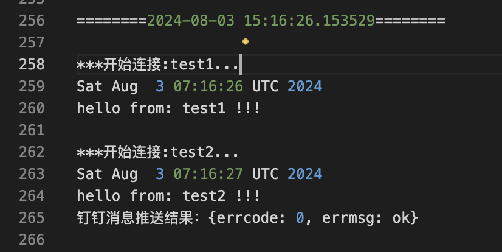
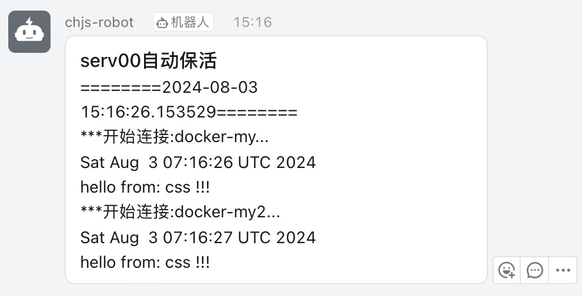

# serv00-keep-live
一个本地使用的serv00保活脚本，使用钉钉群聊机器人推送结果。

### 环境
1.  **安装依赖:** pip install -r requirements.txt
2.  **安装依赖:**

### 使用方法
1.  **申请钉钉自定义机器人:**
    a.  详情参考[钉钉相关文档](https://open.dingtalk.com/document/robots/custom-robot-access)
    b.  创建过程勾选“加签”选项，并保存好**secret**和**Webhook**链接
    c.  提取**Webhook**链接中的**access_token**：https://oapi.dingtalk.com/robot/send?access_token=123456    即**123456**这串字符。

2.  **安装依赖:**

    1.  python3
    2.  pip install -r requirements.txt

3.  **配置文件:** 拷贝项目中的**servers.json.example**文件为**servers.json**,并填入相关信息。

    | 参数 | 类型 | 示例 | 说明 |
    |-------|-------|-------|:------|
    | ding_info | dict |  | 钉钉相关数据 |
    | secret | str | SECa24d5dc8a14c***4f714c872c8808d | 步骤1获取的钉钉secret |
    | access_token | str | 7eeef6e068369d979a***32a3f8098345 | 步骤1获取的钉钉access_token |

    | 参数           | 类型 | 示例          | 说明                                |
    | -------------- | ---- | ------------- | ----------------------------------- |
    | servers        | dict |               | serv00服务器相关数据                |
    | **serv00别称** |      |               | serv00服务器别称，作为每个字典的key |
    | connect        | bool | true/false    | 是否连接保活该服务器                |
    | user           | str  | test          | 服务器username                      |
    | host           | str  | s8.serv00.com | 服务器host                          |
    | port           | Int  | 22            | ssh端口                             |
    | pwd            | str  | testpwd       | 服务器passwork                      |

4.  **本地设置**crontab自动运行

    1.  注意事项：
        1.  需要指定本地python解释器，可用**which python**命令查看
        2.  下面的例子是每周三下午15点自动执行该脚本：

    eg：0 15 * * 3  /Users/test/.venv/bin/python /dev/serv00-keep-live/ding_robot.py

5.  检查结果：

    1. 会在py文件目录下生成ding_robot.log日志文件：

       

    2. 钉钉收到的推送：

       ​	

6.  简易脚本，没做保活失败重试。面对serv00服务器ssh慢的问题也没有做异步处理。

7.  如果有用麻烦多多点点star～
